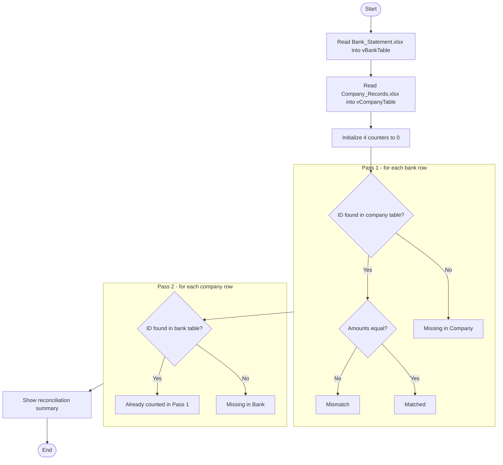

<h1 align="center">🏦 Bank Reconciliation Bot</h1>

  An RPA bot built in <b>Automation Anywhere A360</b> that reconciles a bank statement 
  against company records and classifies every transaction automatically.

  
  
  
  

  

---

## 📑 Table of Contents
- [Overview](#-overview)
- [Results](#-results)
- [Input Data](#-input-data)
- [Workflow](#-workflow)
- [Bot Walkthrough](#-bot-walkthrough)
- [Key Variables](#-key-variables)
- [Tech & Concepts](#-tech--concepts)
- [Challenges & Fixes](#-challenges--fixes)
- [Edge Cases](#-edge-cases)
- [Recreate It Yourself](#-recreate-it-yourself)
- [Future Improvements](#-future-improvements)
- [Author](#-author)

## 📌 Overview

Finance teams spend hours comparing bank statements with internal records by hand.
This bot removes that manual work. It reads two Excel files, compares every transaction by
**TransactionID** and **Amount**, and reports how many are matched, mismatched or missing.

**Highlights**
- Two-pass reconciliation (bank → company and company → bank)
- Detects amount differences and transactions missing on either side
- Cleans amount text (removes commas) before comparing numbers
- Clear summary message with all four counts

## 📊 Results

Output of the bot on the sample data (see the screenshot above):

| Status | Count | Meaning |
|---|:---:|---|
| ✅ Matched | **45** | ID found in both files and amounts are equal |
| ⚠️ Mismatch | **11** | ID found in both files but amounts differ |
| ❌ Missing in Company | **6** | ID exists only in the bank statement |
| ❌ Missing in Bank | **6** | ID exists only in the company records |

## 📂 Input Data

| File | Columns | Rows |
|---|---|:---:|
| `Bank_Statement.xlsx` | TransactionID, Date, Amount | 62 |
| `Company_Records.xlsx` | TransactionID, Date, Amount | 59 |

## ⚙️ Workflow

## 🧭 Bot Walkthrough

The bot has **51 steps**. Each stage below shows the actual bot in Flow view.

### 1️⃣ Load the bank statement (steps 1–4)
Opens `Bank_Statement.xlsx`, reads all cells into `vBankTable`, shows a confirmation message and closes the file.

  

### 2️⃣ Load the company records (steps 5–8)
Same process for `Company_Records.xlsx`, stored in `vCompanyTable`.

  

### 3️⃣ Initialize counters (steps 9–12)
Sets the four result counters to `0` so the totals start clean on every run.

  

### 4️⃣ Pass 1: loop over bank rows (steps 13–16)
For each bank row, stores its TransactionID, resets the `vFound` flag to `False` and resets `vCompanyAmount` to `0`.

  

### 5️⃣ Clean the bank amount (steps 17–19)
Reads the amount as text, removes commas and converts it to a number, so `12,450` becomes `12450`.

  

### 6️⃣ Search the company table (steps 20–26)
An inner loop scans every company row. When the IDs are equal, `vFound` becomes `True` and the company amount is cleaned and converted to a number.

  

### 7️⃣ Compare and classify (steps 27–36)
- `vFound = True` and amounts equal → **Matched**
- `vFound = True` and amounts differ → **Mismatch**
- `vFound = False` → **Missing in Company**

  

### 8️⃣ Pass 2: loop over company rows (steps 37–41)
For each company row, resets `vBankFound` to `False` and starts an inner loop over the bank table.

  

### 9️⃣ Missing in Bank check (steps 42–46)
If a bank row has the same ID, `vBankFound` becomes `True`. After the inner loop ends, `vBankFound = False` means the transaction is **Missing in Bank**.

  

### 🔟 Summary (steps 47–51)
Converts the four counters to text and shows the reconciliation summary in a message box.

  

## 🧩 Key Variables

| Variable | Type | Purpose |
|---|---|---|
| `vBankTable`, `vCompanyTable` | Table | Data read from the Excel files |
| `vCurrentBankRow`, `vCurrentCompanyRow` | Record | Current row in each loop |
| `vFound` | Boolean | Was the bank ID found in the company table? |
| `vBankFound` | Boolean | Was the company ID found in the bank table? |
| `vBankAmount`, `vCompanyAmount` | Number | Cleaned amounts used for comparison |
| `vStatus` | String | Status of the current transaction |
| `vMatchCount`, `vMismatchCount`, `vMissingCompanyCount`, `vMissingBankCount` | Number | Result counters |

## 🛠️ Tech & Concepts

- Automation Anywhere **A360**
- Excel advanced package: Open, Get multiple cells, Close
- Nested **Loop** actions with **If / Else** logic
- Boolean flags for search results
- String cleanup (Replace) and String → Number conversion

## 🐞 Challenges & Fixes

| Problem | Cause | Fix |
|---|---|---|
| Missing counts were always **0** | The `Found` flag was set to `True` *before* the search loop, so every row looked found | Set the flag to `True` only inside the `If IDs are equal` block |
| Missing in Bank count was far too high | The check ran inside the wrong loop, so it was counted many times | Moved the check to run *after* the inner loop, once per company row |
| Summary box appeared repeatedly | Summary steps were indented inside a loop | Moved the summary to the top level, after both loops |

> **Key learning:** in nested loops, where an action sits (its indentation) decides how many times it runs.

## 📝 Edge Cases

- The bank file has **3 duplicate IDs** (T103, T122, T133). The extra row for each is counted as a mismatch, so of the 11 mismatches, 8 are amount differences and 3 are duplicate bank entries.
- Matching is based on **TransactionID and Amount**. Dates are not compared.
- File paths in the *Open* steps are local. Change them to your own paths to run the bot.

## 🔧 Recreate It Yourself

1. Create a new Task Bot in an A360 Control Room.
2. Add the steps shown in the walkthrough above, in the same order and with the same indentation.
3. Update the two file paths in the *Excel advanced: Open* steps.
4. Click **Run**.

## 🚀 Future Improvements

- Compare **Date** along with Amount
- Write results to an Excel report instead of only a message box
- Use a Dictionary or List lookup instead of nested loops (from O(n × m) to O(n + m))
- Flag duplicate IDs as their own status

## 👤 Author

**Sai Kumar Bulasala**

[GitHub](https://github.com/saikumarbulasala) · [LinkedIn](https://linkedin.com/in/bulasala-sai-kumar-18b83a360)
